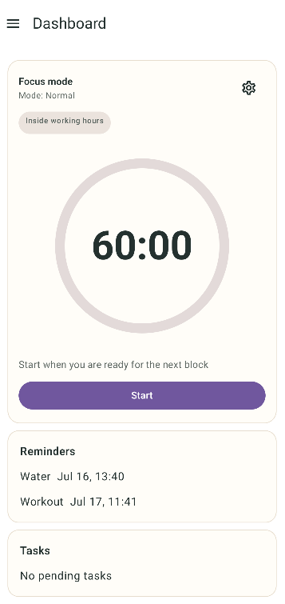
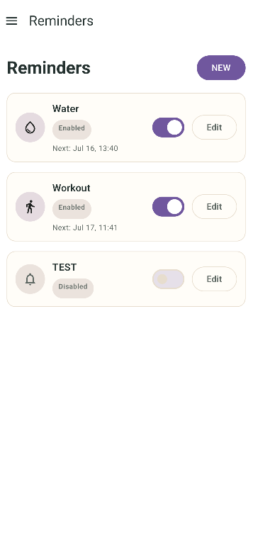
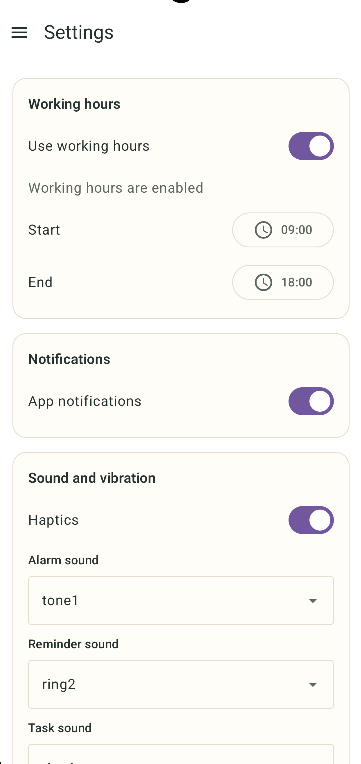

# HealthDesk

HealthDesk is a local-only Android app for healthier workdays.

<IMAGE>

<p align="center">
  
  
  
</p>
<p align="center">
  <em>View the <a href="docs/images/">full screenshot gallery</a> to see dark theme and more :)</em>
</p>
    
## Features

- Focus timer with ready-to-use and custom and custom modes 
- Reminders that fit your day - once, repeating, or at fixed times
- Simple task list with manual ordering and a completion history
- Local stats to see how your focus improves over time
- Home widget to start a session without opening the app
- Make it yours — colors, themes, and a good amount of tweaks
- Multi-language, because not everyone thinks in English
- Backup & portability via local JSON export/import, no cloud, no fuss


## Privacy

HealthDesk is offline-first and local-only.

- No account or login
- No backend or cloud sync
- No Internet permission
- No analytics, advertising, Firebase, Google Sign-In, or crash reporting
- Your data remains on your device unless you export it yourself

## Requirements

- Android 8.0 or newer (API 26)

## Install 

Choose your preferred way to install HelathDesk. 

> F-Droid integration soon


### Manual Installation (GitHub Releases)

1. Go to the GitHub Latest Release Page.
2. Scroll down to the Assets section.
3. Download the .apk file.

#### How to install:

1. Download the .apk file.
2. Open the file on your Android device.
3. If prompted, enable "Install from Unknown Sources" in your settings.
4. Follow the on-screen instructions to finish.


#### Manual Build

To produce the unsigned release APK:

```sh
./gradlew test
./gradlew assembleRelease
```

The output is written to `app/build/outputs/apk/release/app-release-unsigned.apk`.


## License

Inspired in the **[Timety Project](https://github.com/Benji377/Timety)**.

HealthDesk is licensed under the [GNU General Public License v3.0 or later](LICENSE).
